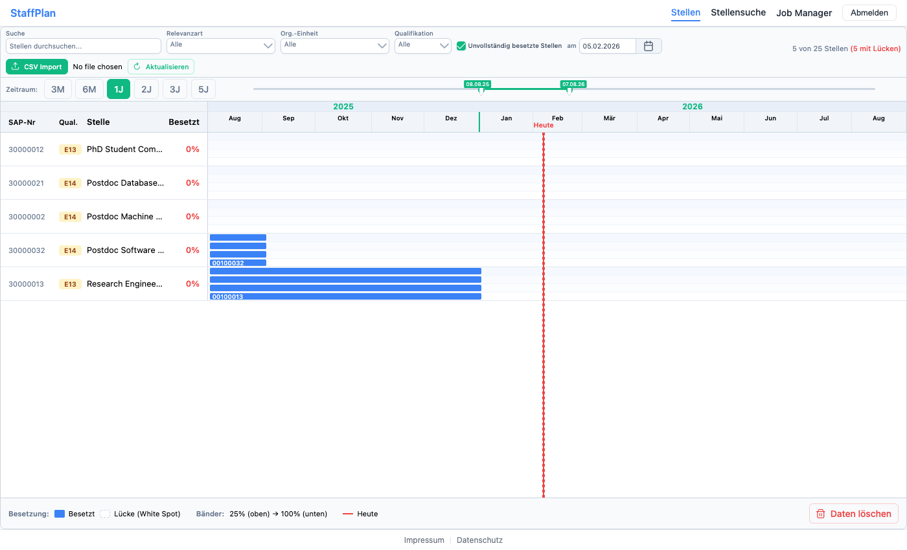
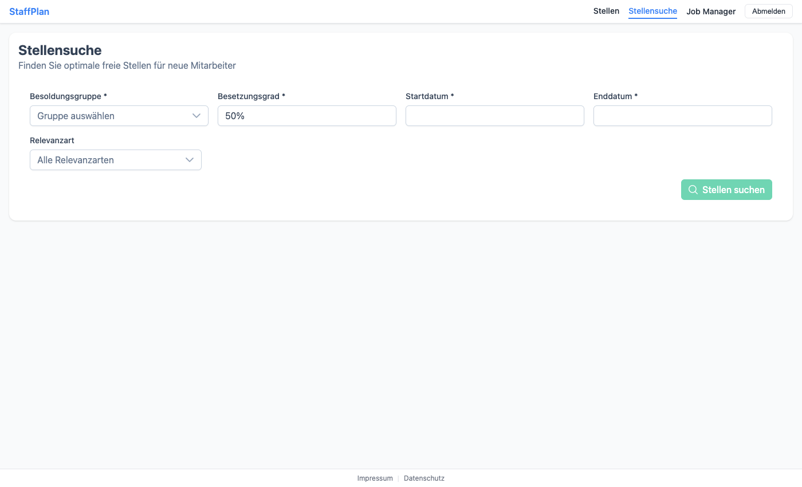

# Position Manager User Guide

Welcome to Position Manager, a web application for strategic staff and budget planning at research institutions. This guide explains how to use all features of Position Manager, from viewing positions to managing research groups.

**Who is this guide for?** All Position Manager users, including administrators, job managers, professors, and employees. Each section notes which roles have access to specific features.

## Table of Contents

1. [Getting Started](#getting-started) - How to log in and navigate the application
2. [Understanding User Roles](#understanding-user-roles) - What each role can do
3. [Positions Overview](#positions-overview) - Viewing and filtering staff positions
4. [Position Finder](#position-finder) - Finding the best position matches
5. [Research Group Management](#research-group-management) - Managing chairs and institutes
6. [User Management](#user-management) - Managing users and their roles
7. [Grade Value Management](#grade-value-management) - Configuring salary grades
8. [Importing Data](#importing-data) - Uploading data from CSV files
9. [Frequently Asked Questions](#frequently-asked-questions) - Common questions and answers

---

## Getting Started

### Logging In

1. Open Position Manager in your web browser
2. Click the **Login** button on the landing page
3. You will be redirected to the university login page (Keycloak)
4. Enter your university credentials (TUM ID and password)
5. After successful authentication, you will be redirected to the main application

### Navigation

After logging in, you will see:
- **Navigation bar** at the top with your available menu items
- **User menu** in the top-right corner showing your name and role
- **Main content area** displaying the current page


*The Positions Overview showing the Gantt chart timeline view*

The menu items you see depend on your assigned role:

| Role | Available Menu Items |
|------|---------------------|
| Admin | Positions, Position Finder, Research Groups, Users, Grade Values |
| Job Manager | Positions, Position Finder |
| Professor | Positions (filtered to your group) |
| Employee | Positions (filtered to your group) |

---

## Understanding User Roles

Position Manager has four user roles with different access levels:

### Administrator (Admin)

Administrators have full access to all features:
- Manage all positions across the university
- Create and manage research groups
- Manage users and assign roles
- Define and modify salary grade values
- Import data from CSV files
- Access all reports and analytics

### Job Manager

Job Managers handle day-to-day position management:
- View and search all positions
- Use the Position Finder to match employees to positions
- Upload position data from CSV files
- View research group information
- Access grade value information

### Professor

Professors have access to their own research group:
- View positions assigned to their research group
- See the Gantt chart visualization of their positions
- Filter and search within their positions
- Track position availability over time

### Employee

Employees have read-only access:
- View positions in their assigned research group
- See the Gantt chart visualization
- Filter and search positions

---

## Positions Overview

The Positions page shows all staff positions in a visual timeline format called a Gantt chart. This gives you a quick overview of when positions start and end, how full they are, and which positions may need attention.

### Understanding the Gantt Chart

The Gantt chart displays positions as horizontal bars on a timeline. Each bar represents one position:

- **Each row** represents a single position
- **The bar length** shows the position's duration (start to end date)
- **The bar color** indicates the salary grade type
- **The fill percentage** is shown on each bar (e.g., "65%" means the position is 65% filled)

### Filtering Positions

Use the filter options above the chart to narrow down the display:

1. **Search**: Type to search by position ID, description, or grade
2. **Status Filter**: Show only active, archived, or all positions
3. **Grade Filter**: Filter by specific salary grades (e.g., E13, E14, W3)
4. **Date Filter**: Highlight positions unfilled on a specific date
5. **Percentage Filter**: Filter by minimum fill percentage

### Adjusting the Timeline

Use the **Zoom** dropdown to change the timeline view:
- **3 months**: Detailed short-term view
- **6 months**: Quarter view
- **12 months**: Annual view (default)
- **24 months**: Two-year planning view
- **36/60 months**: Long-term strategic view

### Understanding Position Details

Each position shows:
- **Object ID**: Unique identifier
- **Description**: Position title (e.g., "PhD Student Machine Learning")
- **Grade**: Salary grade (e.g., E13, E14, W3)
- **Percentage**: How much of the position is filled (0-100%)
- **Organization Unit**: The research group or department
- **Dates**: When the position starts and ends

---

## Position Finder

The Position Finder helps you find available positions that match an employee's requirements. This is useful when you need to place a new employee or extend an existing contract.

**When to use Position Finder:**
- Hiring a new PhD student or postdoc
- Extending an employee's contract
- Finding positions for employees whose current positions are ending
- Exploring available capacity in specific research areas

### How to Search

1. Navigate to **Position Finder** in the menu
2. Fill in the search criteria:
   - **Employee Grade** (required): The salary grade the employee needs (e.g., E13)
   - **Fill Percentage** (required): How much of a position is needed (e.g., 65%)
   - **Start Date** (required): When the employment should begin
   - **End Date** (required): When the employment should end
   - **Research Group** (optional): Limit search to a specific chair or institute
   - **Relevance Type** (optional): Filter by specific position categories
3. Click **Search**


*The Position Finder search form with all filter options*

### How the Search Algorithm Works

The Position Finder uses a sophisticated matching algorithm to find the best available positions for your needs. Here's how it works in simple terms:

#### Step 1: Finding Candidate Positions

First, Position Manager identifies all positions that could potentially accommodate your employee:

1. **Grade Matching**: Only positions with a matching or higher salary grade are considered. For example, if you search for an E13 employee, both E13 and E14 positions will be included (since E14 has a higher budget), but E12 positions will be excluded (insufficient budget).

2. **Optional Filters**: If you specify a research group or relevance type, only positions matching those criteria are included.

3. **Grade Code Normalization**: The system automatically handles different grade formats. "E13", "E 13", "e13", and "E13 TVL" are all treated as the same grade.

#### Step 2: Checking Availability Throughout the Entire Period

This is the most important step. Position Manager ensures the position can accommodate your employee **for the entire time period**, not just on the start date.

**Why this matters:** A position might be 80% available today but fully occupied three months from now. The algorithm checks every date in your requested period and uses the **worst-case availability** to ensure your employee has a guaranteed spot throughout their entire contract.

**How it works:**

1. The algorithm identifies all dates when availability changes (when existing assignments start or end)
2. It divides the time period into slices based on these dates
3. For each slice, it calculates how much of the position is already assigned
4. It takes the **minimum availability** across all slices

**Example:** You search for 50% availability from January to December:
- January-March: 70% available (one 30% assignment)
- April-September: 40% available (additional 30% assignment started)
- October-December: 100% available (all assignments ended)

Result: The position shows only **40% available** because that's the worst-case during your period. This position would NOT match your 50% requirement because there's a period where it cannot accommodate your employee.

#### Step 3: Scoring and Ranking Matches

Positions that pass the availability check are scored based on three factors:

| Factor | Weight | What It Measures |
|--------|--------|------------------|
| **Budget Efficiency** | 50% | How well the position budget matches the employee cost |
| **Split Minimization** | 30% | Whether the position already has other employees |
| **Time Overlap** | 20% | Whether position dates fully cover your needs |

**Budget Efficiency (50% of score):**
- Perfect match (same grade): 100 points
- Higher grade position: Points decrease based on "waste" (unused budget)
- Example: E13 employee on E13 position = 100 points; E13 on E14 = ~85 points

**Split Minimization (30% of score):**
- Empty position (no current assignments): 100 points
- One existing assignment: 80 points
- Two existing assignments: 50 points
- Three or more: 25 points or less

Positions with fewer existing employees are preferred because they're simpler to manage.

**Time Overlap (20% of score):**
- Position fully covers your dates: 100 points
- Partial coverage: Points proportional to overlap
- No overlap: Position is excluded

#### Step 4: Generating Split Suggestions

If no single position can meet your requirements, Position Manager suggests **combinations** of positions:

1. **Finding partial matches**: Identifies all positions with some available capacity
2. **Combining positions**: Tests combinations of 2, 3, or 4 positions
3. **Ranking combinations**: Sorts by fewest positions needed, then by minimal excess

**Example:** You need 100% employment but no single position has that capacity.
Position Manager might suggest: Position A (50%) + Position B (50%) = 100% total

The system returns up to 8 suggestions, preferring:
- Fewer positions (2 splits better than 3)
- Minimal excess (100% total better than 120% total)

### Understanding Results

The search results show matching positions sorted by their overall score:


*Search results showing matching positions with quality ratings and key metrics*

#### Match Quality Indicators

Each result displays a quality rating based on its score:

| Rating | Score | Meaning |
|--------|-------|---------|
| **Excellent** (green) | 85-100 | Perfect or near-perfect match - highly recommended |
| **Good** (blue) | 65-84 | Good match with minor trade-offs |
| **Fair** (yellow) | 40-64 | Acceptable but has compromises |
| **Poor** (red) | Below 40 | Significant issues - consider alternatives |

#### Key Metrics

For each matching position, you'll see:
- **Monthly Cost**: What this position costs per month at the available percentage
- **Available %**: The guaranteed minimum availability throughout your entire period
- **Overlap**: Whether the position dates fully cover your needs
- **Budget Waste**: Difference between position budget and employee cost (lower is better)
- **Assignment Count**: How many employees currently share this position

#### Warning Indicators

Watch for these warning flags:

| Warning | Threshold | What It Means |
|---------|-----------|---------------|
| **High budget waste** | >30% | Significant funds will go unused |
| **Partial overlap** | <80% coverage | Position dates don't fully cover your needs |
| **Multiple assignments** | 2+ employees | Position is already shared by several people |

### Split Suggestions

If no single position matches your needs, the Split Suggestions section shows how to combine multiple positions:

- **Split Count**: Number of positions in the combination (fewer is better)
- **Total Available**: Combined percentage from all positions
- **Excess**: Amount over your requirement (smaller excess is better)
- **Individual Positions**: Details of each position in the combination

**Tips for split suggestions:**
- Combinations with 2 positions are easier to manage than 3 or 4
- Watch for total percentage exceeding your needs - this represents potential budget waste
- Consider if the employee can practically work across multiple research areas

---

## Research Group Management

*Available to: Administrators only*

Research groups represent the organizational units (chairs, institutes) at the university.

### Viewing Research Groups

The Research Groups page shows:
- **Name**: Full name of the research group
- **Abbreviation**: Short code (e.g., I-ML for Machine Learning)
- **Professor**: The assigned head of the group
- **Assignment Status**: Whether the professor is properly linked
- **Department**: The parent department
- **Position Count**: Number of positions assigned
- **Status**: Active or Archived

### Creating a Research Group

1. Click **Add** (Hinzufügen)
2. Fill in the required fields:
   - **Name**: Full name (must be unique)
   - **Abbreviation**: Short code (must be unique)
3. Fill in optional fields:
   - **Department**: Select from dropdown
   - **Campus**: Select location
   - **Professor Name**: First and last name
   - **Professor Email**: Their email address
   - **Professor University ID**: Their login ID (e.g., ga69hun)
   - **Website URL**: Group homepage
   - **Description**: Additional information
4. Click **Create** (Erstellen)

### Professor Assignment Status

The **Assignment** column shows how the professor is linked:

| Icon | Status | Meaning |
|------|--------|---------|
| ✓ (green) | Mapped | Professor is linked via University ID |
| ✉ (blue) | Email | Will be matched when professor logs in via email |
| ⚠ (orange) | Manual | Requires manual assignment by admin |
| - | None | No professor information available |

### Importing Research Groups

1. Click **CSV Import**
2. Select your CSV file
3. Review the import results:
   - **Created**: New groups added
   - **Updated**: Existing groups modified
   - **Skipped**: Duplicate or invalid entries
   - **Errors/Warnings**: Issues to review

CSV format:
```
firstName,lastName,groupName,abbreviation,department,email,login
Maria,Schneider,Machine Learning,I-ML,Computer Science,maria.schneider@tum.de,ml52sch
```

### Assigning Positions to Groups

To automatically match positions to research groups:

1. Click **Positionen zuordnen** (Assign Positions)
2. The system matches positions based on organization unit names
3. Review the results showing matched and unmatched positions

---

## User Management

*Available to: Administrators only*

### Viewing Users

The Users page shows all users with:
- **Name**: First and last name
- **University ID**: Login identifier
- **Email**: Contact email
- **Roles**: Assigned roles (admin, job_manager, professor, employee)
- **Research Group**: Assigned group (if any)

### Managing User Roles

1. Find the user in the list
2. Click the **Edit** icon
3. Check/uncheck the role checkboxes:
   - **Admin**: Full administrative access
   - **Job Manager**: Position management access
   - **Professor**: Research group access
   - **Employee**: Read-only access
4. Click **Save**

### Understanding Login Status

Users show a **"Nie angemeldet"** (Never logged in) tag if they were created via import but haven't logged in yet. This helps identify:
- Newly imported professors who need to activate their accounts
- Users who may need assistance logging in

---

## Grade Value Management

*Available to: Administrators only*

Grade values define the salary grades used in positions.

### Understanding Grades

| Type | Description | Examples |
|------|-------------|----------|
| E | Employee grades (TV-L/TVöD) | E8, E9, E10, E11, E12, E13, E14, E15 |
| A | Civil service grades | A9, A10, A11, A12, A13, A14, A15, A16 |
| W | Professor grades | W1, W2, W3 |
| C | Legacy professor grades | C2, C3, C4 |
| SPECIAL | Special positions | Custom grades |

### Managing Grades

**To add a new grade:**
1. Click **Add Grade**
2. Enter:
   - **Grade Code**: Unique identifier (e.g., E13)
   - **Type**: Select grade type
   - **Display Name**: User-friendly name
   - **Monthly Value**: Salary for calculations
   - **Min/Max Salary**: Salary range (optional)
3. Click **Save**

**To edit a grade:**
1. Click the edit icon next to the grade
2. Modify the values
3. Click **Save**

**To delete a grade:**
1. Click the delete icon
2. Confirm deletion
3. Note: Grades in use cannot be deleted

---

## Importing Data

### Position Import

*Available to: Job Managers and Administrators*

1. Navigate to **Positions**
2. Click **Import** or use the upload button
3. Select your CSV file
4. The system automatically:
   - Detects the delimiter (comma, semicolon, or tab)
   - Parses various date formats
   - Validates data integrity
5. Review the import count

### Research Group Import

*Available to: Administrators only*

1. Navigate to **Research Groups**
2. Click **CSV Import**
3. Select your CSV file with format:
   ```
   firstName,lastName,groupName,abbreviation,department,email,login
   ```
4. Review the import results

### Tips for Successful Imports

- **Encoding**: Save CSV files as UTF-8
- **Headers**: Include a header row with column names
- **Dates**: Use common formats (DD.MM.YYYY, MM/DD/YY, YYYY-MM-DD)
- **Empty values**: Leave fields blank if unknown (don't use "N/A")
- **Duplicates**: Existing records are updated, not duplicated

---

## Frequently Asked Questions

### General Questions

**Q: I can't see any positions. What's wrong?**

A: Check these common causes:
1. Your user might not have the correct role assigned
2. As a professor/employee, you can only see positions in your research group
3. There might not be any positions in the system yet
4. Try adjusting the filters (they might be hiding positions)

**Q: How do I change my password?**

A: Passwords are managed through the university's central authentication system (Keycloak). Contact your IT department if you need to reset your password.

**Q: Why can't I edit certain positions?**

A: Position editing depends on your role:
- Professors and employees have read-only access
- Job managers can import but not edit individual positions
- Only administrators have full editing capabilities

### Position Finder Questions

**Q: What does "budget waste" mean?**

A: Budget waste shows the difference between what a position costs and what you actually need. This happens in two scenarios:
1. **Grade difference**: Placing an E13 employee on an E14 position means the extra budget allocated for the higher grade goes unused.
2. **Percentage difference**: If a position has 80% available but you only need 65%, the remaining 15% represents unused capacity.

Budget waste isn't always bad - sometimes it's the only option - but the algorithm prefers positions that minimize waste.

**Q: Why are there no results for my search?**

A: Common reasons:
1. **Grade mismatch**: No positions have a grade equal to or higher than what you searched for
2. **No availability**: All matching positions are already fully assigned during your date range
3. **Insufficient continuous availability**: Positions might have capacity at the start or end of your period, but not throughout the entire time
4. **Too restrictive filters**: Try removing the research group or relevance type filter
5. **Date range issues**: Very long date ranges are harder to match since positions need continuous availability

**Q: What is a "split suggestion"?**

A: When no single position can fulfill your requirements, Position Manager suggests combining multiple partial positions. For example, two 50% positions could cover a 100% need. The algorithm:
- Tests combinations of 2, 3, and 4 positions
- Filters those that meet your total percentage requirement
- Ranks them by fewest positions needed and minimal excess

**Q: Why does a position show less availability than I expected?**

A: The Position Finder shows the **minimum guaranteed availability** throughout your entire search period. Even if a position is 100% available today, if it will be partially occupied during any part of your requested time frame, the availability shown reflects the worst-case scenario. This ensures your employee will have a guaranteed spot for their entire contract duration.

**Q: What do the match quality ratings (Excellent, Good, Fair, Poor) mean?**

A: These ratings reflect the overall match score, which is calculated from three factors:
- **Budget Efficiency (50%)**: How well the position budget matches your employee's cost
- **Split Minimization (30%)**: Positions with fewer existing assignments score higher
- **Time Overlap (20%)**: Positions that fully cover your date range score higher

An "Excellent" match (85-100 score) typically means: same grade, empty or nearly empty position, and full date coverage.

**Q: Can I place an E13 employee on an E14 position?**

A: Yes. An employee can be placed on a position with a higher grade than they need - the position has sufficient budget. However, this results in "budget waste" (the difference in monthly cost between E14 and E13). The algorithm will still show these matches but scores them lower than perfectly matched grades.

**Q: Why isn't my employee's grade recognized?**

A: The system normalizes grade codes automatically (e.g., "E13", "E 13", "e13" are all recognized). If you see "Unknown grade" errors:
1. Check for typos in the grade code
2. The grade might not be configured in the system yet - contact an administrator to add it via Grade Value Management

**Q: What does "multiple assignments" warning mean?**

A: This indicates that the position already has 2 or more employees assigned to it. While splitting positions is allowed, heavily-split positions:
- Are more complex to manage administratively
- May have coordination challenges
- Score lower in the matching algorithm

You can still choose such positions, but consider whether the administrative overhead is acceptable.

### Research Group Questions

**Q: What does "Needs Manual Mapping" mean?**

A: This indicates that the system couldn't automatically identify the professor for this research group. An administrator needs to manually assign the correct professor or update the professor's University ID.

**Q: How do professors get assigned to their groups?**

A: There are three ways:
1. **Automatic by ID**: If the professor's University ID matches, they're assigned automatically on login
2. **Automatic by email**: If the professor's email matches, they're assigned on login
3. **Manual**: An administrator assigns them directly

### Technical Questions

**Q: What browsers are supported?**

A: Position Manager works best with:
- Google Chrome (recommended)
- Mozilla Firefox
- Microsoft Edge
- Safari

**Q: Why is the page loading slowly?**

A: Large datasets can take time to load. Try:
1. Using filters to reduce the data displayed
2. Selecting a shorter time range in the Gantt chart
3. Clearing your browser cache

**Q: I'm getting a "Session Expired" error. What do I do?**

A: Your login session has timed out. Simply refresh the page and log in again.

---

## Quick Tips

- **Bookmark the application**: Save the Position Manager URL for easy access
- **Use filters**: If pages load slowly, use filters to reduce the displayed data
- **Check your role**: If you cannot see expected features, verify your role is correct with an administrator
- **Clear browser cache**: If you experience display issues, try clearing your browser's cache and cookies

---

*Last updated: February 5, 2026*
